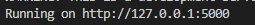

FHIR-CONNECTOR 
=================================================

[](https://github.com/mhucka/readmine/releases)

[](https://travis-ci.org/anfederico/clairvoyant)
[](https://opensource.org/licenses/MIT)


Table of contents
-----------------

- [FHIR-CONNECTOR](#fhir-connector)
  - [Table of contents](#table-of-contents)
  - [Introduction](#introduction)
  - [Installation](#installation)
    - [Requirements](#requirements)
    - [Deployment](#deployment)
  - [Usage](#usage)
  - [Known issues and limitations](#known-issues-and-limitations)
  - [Getting help](#getting-help)
  - [Contributing](#contributing)
  - [License](#license)
  - [Authors and history](#authors-and-history)


Introduction
------------
This reporistory includes a first approach to a tool capable of transforming information from different sources into FHIR format. However, for the first version, the connector recreates how it works by means of an example of a Patient. 

The following sections in the README document help to install and deploy the connector and understand how the transformation tool has been developed. 

Installation
------------

### Requirements

First of all, because the connector has been developed in Python, we will need a framework to deploy the application. In this case, it have been used _Flask v2.0.2_ for the simplicity and speed. 

At the same time, the development of the code requires the use of the _requests_ library, which is also included in this file. Thanks to this library, GET and POST methods can be executed.

- requirements.txt
  - Flask
  - requests 

### Deployment

The deployment of the app is been explained in the following lines. 

Firstly, is necessary to clone the repository in the command line.  

```bash
> git clone _path_
```
After that, the folder with all the documents will be in local. We sholud go to the path where the folder has been saved:

```bash
> cd path/fhir-connector
```
Once this has been done, we could deploy the container to run the application. For that: 

```bash
> docker build -t _name container_ . 
```
Finally, the container has been created and is time run it. 

```bash
> docker run -it -p 5000:5000 _name container_  
```

By executing this command, the service example of the fhir connector will be deploy locally. In the next section, we will explain the way to try it. 

Usage
-----
Once the container is created and running, through the command terminal returns a localhost address where our service is up. The format will be as follows http://127.0.0.x:5000, where the 5000 indicates the port.




When we open it in the browser we will be able to observe a json in FHIR format, corresponding to a _Patient_. 


Known issues and limitations
----------------------------
The connector explain in the previous sections is an example of how we will work the final fhir-connector in the following MVPs. Therefore, take this code as an approximation of the final result. 

Getting help
------------

Contributing
------------

License
-------
The license Apache Software License 2.0

Authors and history
---------------------------
The autors of this repository are: 
- Alvaro Belmar
- Guillermo Mejias
- Oscar Ansotegui
- Isabel Varona
